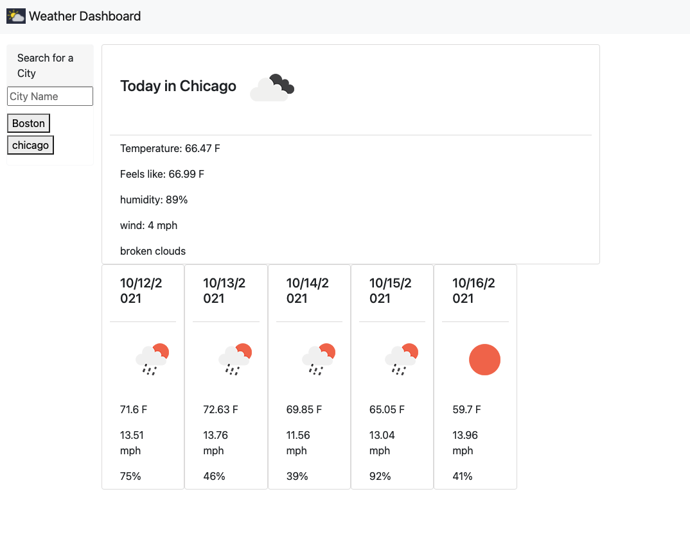
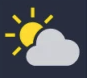

# weather_dashboard
search a city and get the current weather along with the 5 day forecast
HTML - 
Snippet - 

## Goals
* Create HTML using Bootstrap
* Style HTML to make a good looking site on mobile
* use fetch to get data from APIs 
* Use data to populate current weather and a 5 day forecast
* Have a search bar to look up a city's forecast
* Save input to see recent searches

### HTML
* Boot strap to make navbar, search, cards
```
<nav class="navbar navbar-light bg-light mb-3">
        <div class="container-fluid">
          <a class="navbar-brand" href="#">
            
            Weather Dashboard
          </a>
        </div>
</nav>
```
* present day weather
```
<div class="card">
    <div class="card-body">
        <h4 class="card-title">Card title</h4>
    </div>
    <ul class="list-group list-group-flush">
        <li class="list-group-item border-0" id="temp">An item</li>
        <li class="list-group-item border-0" id="feelsLike">A second item</li>
        <li class="list-group-item border-0" id="humidity">A third item</li>
        <li class="list-group-item border-0" id="wind">A forth item</li>
        <li class="list-group-item border-0" id="description">A fifth item</li>
    </ul>
</div>
```

#### fetch function
* Use one function to fetch all of the information

* first fetch in function get present weather and sets up second call with lat and lon
```
fetch(currentWeatherAPI)
    // checks to see if the response is ok
    .then(function(response) {
        if (response.status !== 200) {
            // change to correct html
            document.location.replace()
        } else {
            // return readable data
            return response.json()
        }
    })
    .then(function(data) {
        // use data to put into function
        populateCurrentWeather(data)
        // pull lat and lon out of data and put into oneCall API url to fetch that data
        var lat = data.list[0].coord.lat
        var lon = data.list[0].coord.lon
```

##### populating weather with API data
* making 5 day forecast with a for loop
```
// same concept as the currentweather API, but this one uses oneCall 
function fiveDayPop(oneCallData) {
    for (var i = 0; i < days.length; i++) {
        // use plus one because in api fetch [0] is for current day
        var dateObject = new Date(oneCallData.daily[i+1].dt*1000)
        // days[i] is is the days array with content of #days
        days[i].find("h5").text(dateObject.toLocaleDateString())
        var $icon = oneCallData.daily[i+1].weather[0].icon
        days[i].find("#icon").html("")
        var $temp = oneCallData.daily[i+1].temp.max
        days[i].find("#temp").text(`${$temp} F`)
        var $wind = oneCallData.daily[i+1].wind_speed
        days[i].find("#wind").text(`${$wind} mph`)
        var $humidity = oneCallData.daily[i+1].humidity
        days[i].find("#humidity").text(`${$humidity}%`)
    }
}
```

###### Search city and inputs
* input val is taken and saved to local storage to be used later
* list of cities submitted are created

```
function searchCity(event) {
    event.preventDefault()
    // sets variable equal to the value and then trims
    city = inputField.val()
    city.trim()
    // pushes city to the cities array
    cities.push(city)
    // saves array to local storage
    localStorage.setItem("city", JSON.stringify(cities))
    createButton()
    // sets inputfield back to empty
    inputField.val("")
    // set currentWeatherAPI url for fetchWeather to use with city 
    currentWeatherAPI = `https://api.openweathermap.org/data/2.5/find?q=${city}&units=imperial&appid=f064d5cc6e2d5f072655cd51c2f3385d`;   
    fetchWeather()
}
```